# Ocean View Resort – System Design Document

> **Stack:** Java 11 · Jakarta Servlet 4.0 (javax) · JSP · MySQL 8 · Apache Tomcat 9  
> **Build:** Apache Maven (WAR packaging)  
> **Architecture:** Service-Oriented Architecture (SOA) with Singleton DB connection

---

## Table of Contents

1. [System Overview](#1-system-overview)
2. [Architecture Overview](#2-architecture-overview)
3. [Actors & System Roles](#3-actors--system-roles)
4. [Use Case Diagram](#4-use-case-diagram)
5. [Class Diagram](#5-class-diagram)
6. [Sequence Diagrams](#6-sequence-diagrams)
   - 6.1 Login
   - 6.2 Add Reservation
   - 6.3 View Reservation Details
   - 6.4 Calculate & Print Bill
   - 6.5 Update Room Status
   - 6.6 View Reports
   - 6.7 Exit System
7. [Design Patterns Used](#7-design-patterns-used)
8. [Database Schema](#8-database-schema)
9. [Assumptions](#9-assumptions)

---

## 1. System Overview

The **Ocean View Resort Management System** is a web-based application for managing hotel operations by resort staff. It handles:

| Module        | Feature Summary                                                      |
|---------------|----------------------------------------------------------------------|
| Authentication| Login / logout / session management with role display                |
| Reservations  | Create, list, and view detailed guest bookings                       |
| Rooms         | View all rooms, availability summary, update room status             |
| Guests        | Auto-derived guest profiles from booking history                     |
| Payments      | List all reservations with computed bill totals and invoice links     |
| Reports       | KPI dashboard with interactive charts (Chart.js)                     |
| Billing       | Detailed printable invoice (room charge + 10% tax + 5% service)      |
| Help          | Staff user guide (9 collapsible sections)                            |
| Exit          | Safe session termination with goodbye screen                         |

---

## 2. Architecture Overview

The application follows a **4-tier SOA layered architecture**:

```
Browser (JSP Views)
       │  HTTP Request/Response
       ▼
Servlet Layer  (Controller)     – javax.servlet.HttpServlet subclasses
       │  delegates business logic
       ▼
Service Layer  (Business Logic) – interfaces + implementation classes
       │  delegates data access
       ▼
DAO Layer      (Data Access)    – interfaces + implementation classes
       │  JDBC SQL
       ▼
Database       (MySQL)          – ocean database (users, reservations, rooms)
       │
DBConnection (Singleton)        – single shared JDBC Connection
```

**Request flow:**  
`Browser → Servlet → Service → DAO → DBConnection (Singleton) → MySQL`  
Response: `DAO → Service → Servlet → JSP → Browser`

---

## 3. Actors & System Roles

| Actor             | Description                                                                                                       |
|-------------------|-------------------------------------------------------------------------------------------------------------------|
| **Front Desk Staff**  | Logs in, adds/views reservations, views guests, calculates bills, manages room status. Default role: `staff`  |
| **Manager**           | Same access as Staff plus can view full financial reports and analytics. Role: `manager`                      |
| **Admin**             | Full system access, manages users and all modules. Role: `admin`                                              |
| **MySQL Database**    | External system actor — stores and retrieves all persistent data via JDBC                                     |
| **Tomcat Container**  | External system actor — hosts the WAR, manages servlet lifecycle, fires `DBInitializer` on startup            |

> **Assumption:** All three human actors (Staff, Manager, Admin) share the same login page and the same set of screens. Role differentiation is stored in the `users.role` column but UI-level role-based access control (hiding/showing features per role) is not yet enforced — all authenticated users see all modules.

---

## 4. Use Case Diagram

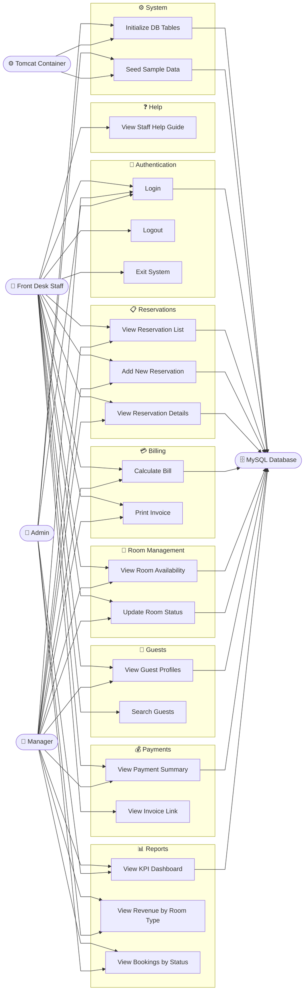

---

## 5. Class Diagram

```mermaid
classDiagram
    direction TB

    %% ═══════════════════════════════════
    %%  DB Layer
    %% ═══════════════════════════════════
    class DBConnection {
        -String URL
        -String USER
        -String PASSWORD
        -static DBConnection instance
        -Connection connection
        -DBConnection()
        +static synchronized getInstance() DBConnection
        -static isConnectionClosed() boolean
        +getConnection() Connection
    }

    class DBInitializer {
        +contextInitialized(ServletContextEvent) void
        +contextDestroyed(ServletContextEvent) void
    }

    %% ═══════════════════════════════════
    %%  Model Layer
    %% ═══════════════════════════════════
    class User {
        -int id
        -String username
        -String password
        -String role
        -String email
        -String fullName
        +getId() int
        +getUsername() String
        +getRole() String
        +getFullName() String
    }

    class Reservation {
        -int id
        -String reservationNumber
        -String guestName
        -String address
        -String contactNumber
        -String roomType
        -Date checkInDate
        -Date checkOutDate
        -String status
        -Date createdAt
        +getReservationNumber() String
        +getGuestName() String
        +getRoomType() String
        +getStatus() String
    }

    class Room {
        -int id
        -String roomNumber
        -String roomType
        -int floor
        -int capacity
        -double pricePerNight
        -String status
        -String description
        +getRoomNumber() String
        +getStatus() String
        +getPricePerNight() double
    }

    class Guest {
        -String guestName
        -String contactNumber
        -String address
        -int totalReservations
        -Date lastVisit
        -String lastRoomType
        -String lastStatus
        +getGuestName() String
        +getTotalReservations() int
    }

    class Bill {
        +double TAX_RATE = 0.10
        +double SERVICE_RATE = 0.05
        -Reservation reservation
        -double ratePerNight
        -long nights
        -double subtotal
        -double taxAmount
        -double serviceChargeAmount
        -double grandTotal
        +getGrandTotal() double
        +getNights() long
    }

    class RoomRates {
        -static Map~String,Double~ RATES
        +static getRate(String roomType) double
    }

    %% ═══════════════════════════════════
    %%  DAO Interfaces
    %% ═══════════════════════════════════
    class UserDAO {
        <<interface>>
        +findByUsernameAndPassword(String, String) User
        +findByUsername(String) User
    }

    class ReservationDAO {
        <<interface>>
        +save(Reservation) int
        +findAll() List~Reservation~
        +findById(int) Reservation
        +findByReservationNumber(String) Reservation
        +count() int
    }

    class RoomDAO {
        <<interface>>
        +findAll() List~Room~
        +findById(int) Room
        +save(Room) int
        +updateStatus(int, String) boolean
        +countByStatus(String) int
    }

    class GuestDAO {
        <<interface>>
        +findAllGuests() List~Guest~
        +countUniqueGuests() int
    }

    %% ═══════════════════════════════════
    %%  DAO Implementations
    %% ═══════════════════════════════════
    class UserDAOImpl {
        -Connection connection
        +findByUsernameAndPassword(String, String) User
        +findByUsername(String) User
    }

    class ReservationDAOImpl {
        -Connection connection
        +save(Reservation) int
        +findAll() List~Reservation~
        +findById(int) Reservation
        +findByReservationNumber(String) Reservation
        +count() int
    }

    class RoomDAOImpl {
        -Connection connection
        +findAll() List~Room~
        +findById(int) Room
        +save(Room) int
        +updateStatus(int, String) boolean
        +countByStatus(String) int
    }

    class GuestDAOImpl {
        -Connection connection
        +findAllGuests() List~Guest~
        +countUniqueGuests() int
    }

    %% ═══════════════════════════════════
    %%  Service Interfaces
    %% ═══════════════════════════════════
    class UserService {
        <<interface>>
        +login(String, String) User
    }

    class ReservationService {
        <<interface>>
        +addReservation(String, String, String, String, String, String) boolean
        +getAllReservations() List~Reservation~
        +getReservationById(int) Reservation
    }

    class RoomService {
        <<interface>>
        +getAllRooms() List~Room~
        +getRoomById(int) Room
        +updateRoomStatus(int, String) boolean
        +countByStatus(String) int
    }

    class GuestService {
        <<interface>>
        +getAllGuests() List~Guest~
        +countUniqueGuests() int
    }

    class BillService {
        <<interface>>
        +calculateBill(int) Bill
    }

    class ReportService {
        <<interface>>
        +totalReservations() int
        +reservationsByStatus() Map
        +revenueByRoomType() Map
        +reservationsByRoomType() Map
        +totalRevenue() double
        +totalGuests() int
        +totalRooms() int
        +availableRooms() int
    }

    %% ═══════════════════════════════════
    %%  Service Implementations
    %% ═══════════════════════════════════
    class UserServiceImpl {
        -UserDAO userDAO
        +login(String, String) User
    }

    class ReservationServiceImpl {
        -ReservationDAO reservationDAO
        +addReservation(...) boolean
        +getAllReservations() List~Reservation~
        +getReservationById(int) Reservation
    }

    class RoomServiceImpl {
        -RoomDAO roomDAO
        +getAllRooms() List~Room~
        +updateRoomStatus(int, String) boolean
        +countByStatus(String) int
    }

    class GuestServiceImpl {
        -GuestDAO guestDAO
        +getAllGuests() List~Guest~
        +countUniqueGuests() int
    }

    class BillServiceImpl {
        -ReservationDAO reservationDAO
        +calculateBill(int) Bill
    }

    class ReportServiceImpl {
        -Connection connection
        -GuestDAO guestDAO
        -RoomDAO roomDAO
        +totalReservations() int
        +totalRevenue() double
        +revenueByRoomType() Map
        +reservationsByStatus() Map
    }

    %% ═══════════════════════════════════
    %%  Servlet Layer
    %% ═══════════════════════════════════
    class LoginServlet {
        +doGet(req, res) void
        +doPost(req, res) void
    }

    class DashboardServlet {
        +doGet(req, res) void
    }

    class ReservationServlet {
        -ReservationService reservationService
        +doGet(req, res) void
        +doPost(req, res) void
    }

    class RoomServlet {
        -RoomService roomService
        +doGet(req, res) void
        +doPost(req, res) void
    }

    class GuestServlet {
        -GuestService guestService
        +doGet(req, res) void
    }

    class PaymentServlet {
        -ReservationService reservationService
        -BillService billService
        +doGet(req, res) void
    }

    class BillServlet {
        -BillService billService
        +doGet(req, res) void
    }

    class ReportServlet {
        -ReportService reportService
        +doGet(req, res) void
    }

    class HelpServlet {
        +doGet(req, res) void
    }

    class LogoutServlet {
        +doGet(req, res) void
    }

    class ExitServlet {
        +doGet(req, res) void
    }

    %% ═══════════════════════════════════
    %%  Relationships
    %% ═══════════════════════════════════

    %% Singleton
    DBInitializer ..> DBConnection : uses

    %% DAO impl → DBConnection
    UserDAOImpl       ..> DBConnection : uses
    ReservationDAOImpl ..> DBConnection : uses
    RoomDAOImpl       ..> DBConnection : uses
    GuestDAOImpl      ..> DBConnection : uses
    ReportServiceImpl ..> DBConnection : uses

    %% DAO impl → interface
    UserDAOImpl        ..|> UserDAO
    ReservationDAOImpl ..|> ReservationDAO
    RoomDAOImpl        ..|> RoomDAO
    GuestDAOImpl       ..|> GuestDAO

    %% Service impl → interface
    UserServiceImpl       ..|> UserService
    ReservationServiceImpl ..|> ReservationService
    RoomServiceImpl        ..|> RoomService
    GuestServiceImpl       ..|> GuestService
    BillServiceImpl        ..|> BillService
    ReportServiceImpl      ..|> ReportService

    %% Service → DAO
    UserServiceImpl       --> UserDAO
    ReservationServiceImpl --> ReservationDAO
    RoomServiceImpl        --> RoomDAO
    GuestServiceImpl       --> GuestDAO
    BillServiceImpl        --> ReservationDAO
    ReportServiceImpl      --> GuestDAO
    ReportServiceImpl      --> RoomDAO

    %% Servlet → Service
    LoginServlet      --> UserService
    ReservationServlet --> ReservationService
    RoomServlet        --> RoomService
    GuestServlet       --> GuestService
    PaymentServlet     --> ReservationService
    PaymentServlet     --> BillService
    BillServlet        --> BillService
    ReportServlet      --> ReportService

    %% Bill → Reservation
    Bill --> Reservation : contains
    Bill ..> RoomRates   : uses

    %% Guest derived from Reservation (conceptual)
    GuestDAOImpl ..> Reservation : queries
```

---

## 6. Sequence Diagrams

### 6.1 Login

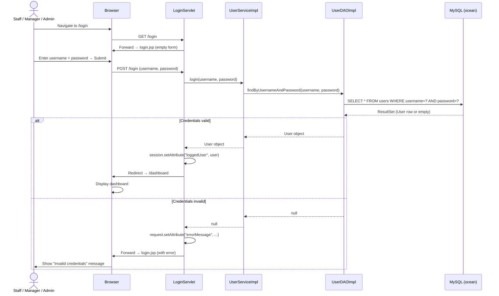

---

### 6.2 Add New Reservation

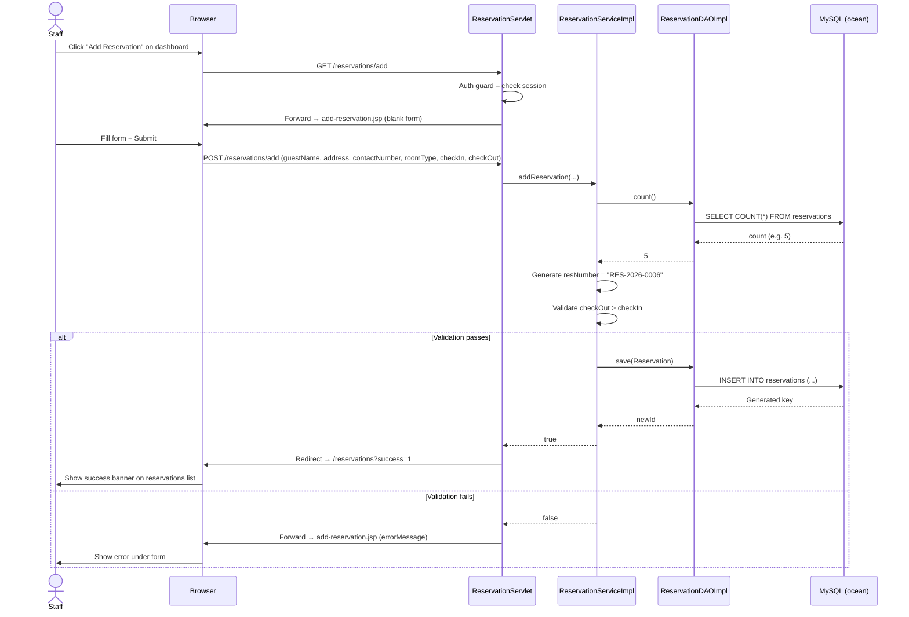

---

### 6.3 View Reservation Details

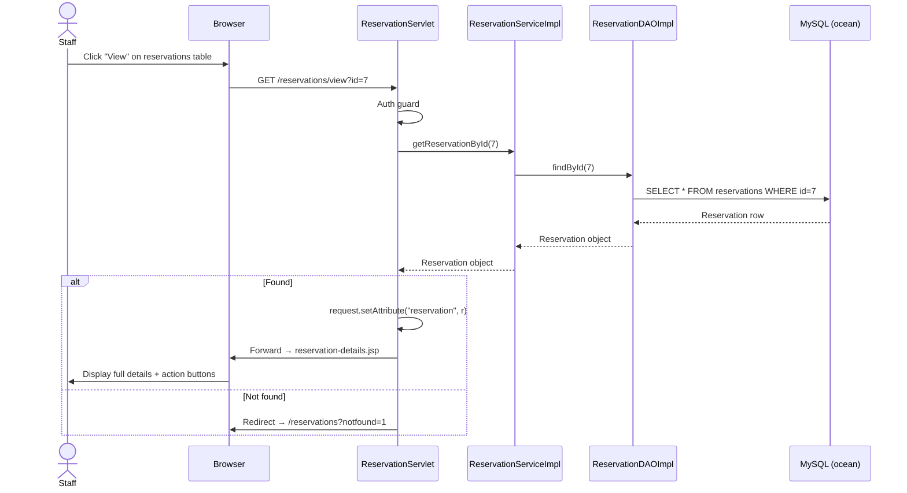

---

### 6.4 Calculate & Print Bill

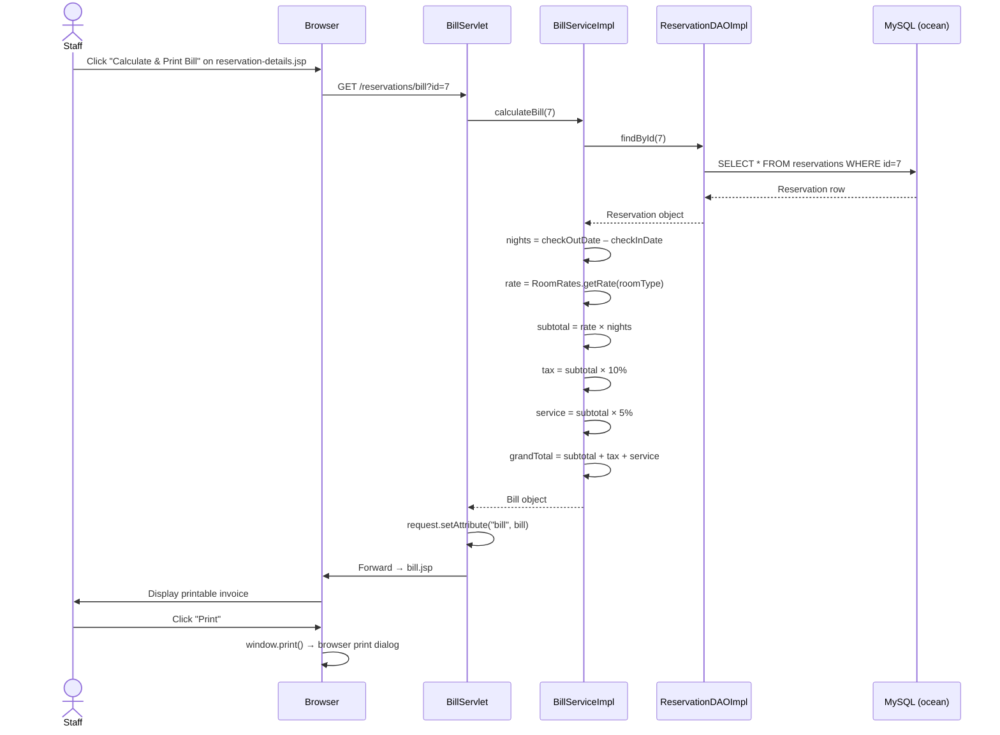

---

### 6.5 Update Room Status

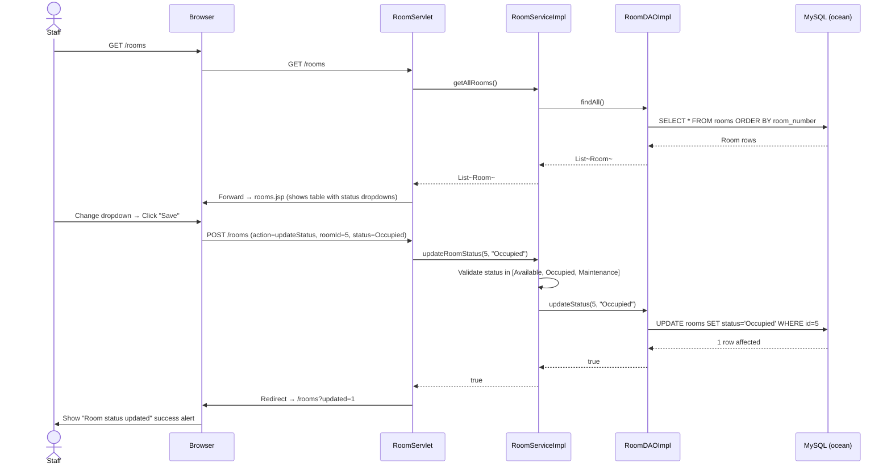

---

### 6.6 View Reports (Analytics Dashboard)

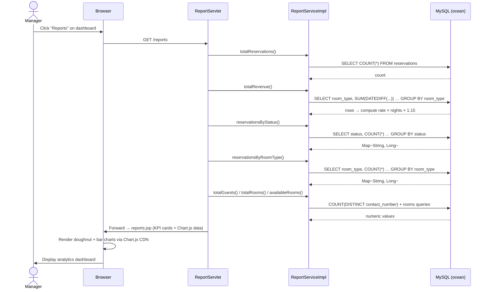

---

### 6.7 Exit System

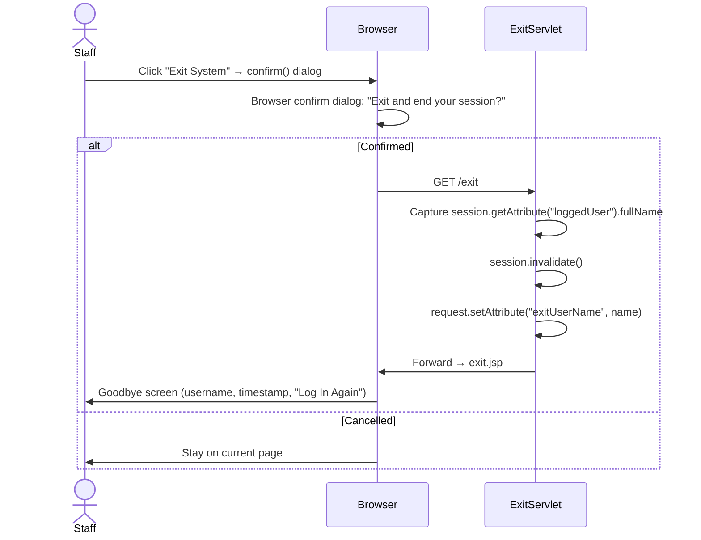

---

## 7. Design Patterns Used

### 7.1 Singleton – `DBConnection`

```
Problem:  Creating a new JDBC connection per request is expensive and
          leads to connection pool exhaustion.
Solution: DBConnection holds ONE static instance with a synchronized
          getInstance() factory method. A closed-connection check
          (isConnectionClosed()) allows automatic reconnection.
```

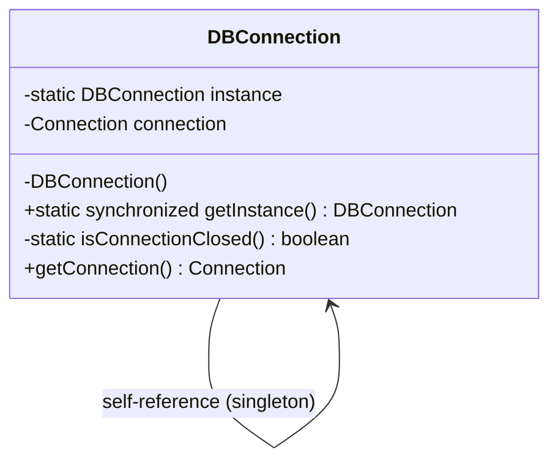

---

### 7.2 Service-Oriented Architecture (SOA) Layering

Each functional module is split into three clear layers:

| Layer            | Responsibility                                   | Example                          |
|------------------|--------------------------------------------------|----------------------------------|
| **Servlet**      | HTTP request handling, session auth guard        | `ReservationServlet`             |
| **Service**      | Business logic, validation, number generation    | `ReservationServiceImpl`         |
| **DAO**          | SQL queries, result mapping                      | `ReservationDAOImpl`             |

Each layer communicates **only with the layer directly below it** — a Servlet never calls a DAO directly.

---

### 7.3 MVC (Model-View-Controller) via Servlet + JSP

| MVC Role       | Technology                    |
|----------------|-------------------------------|
| **Model**      | POJOs: `User`, `Reservation`, `Room`, `Guest`, `Bill` |
| **View**       | JSP pages (login.jsp, dashboard.jsp, reservations.jsp, …) |
| **Controller** | HttpServlet subclasses        |

---

### 7.4 Strategy Pattern (implicit) – `RoomRates`

`RoomRates` uses a static `Map<String, Double>` to decouple room-type pricing from the billing algorithm. Adding or changing a rate requires modifying only `RoomRates.java`, not `BillServiceImpl`.

---

### 7.5 Listener / Init Pattern – `DBInitializer`

`DBInitializer` implements `ServletContextListener` annotated with `@WebListener`. Tomcat fires `contextInitialized()` on deployment before any HTTP request arrives, executing `CREATE TABLE IF NOT EXISTS` plus seed data — decoupling schema management from runtime request handling.

---

## 8. Database Schema

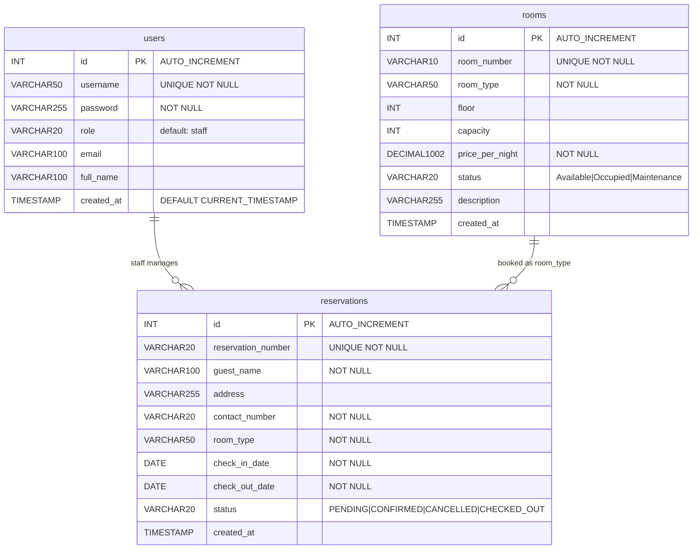

> **Note:** `reservations.room_type` stores the type name (e.g. `"Deluxe"`) rather than a foreign key to `rooms.id`. This is intentional — a guest books a room *type*, not a specific physical room. The `rooms` table tracks physical inventory separately.

---

## 9. Assumptions

| # | Assumption |
|---|------------|
| 1 | **No password hashing** — passwords are stored and compared as plain text. This is acceptable for a prototype/internal tool but must be upgraded (e.g., BCrypt) before production. |
| 2 | **Single shared DB connection** — the Singleton pattern reuses one JDBC connection. This is not thread-safe under concurrent load. In production, a JNDI connection pool (e.g., HikariCP, Tomcat DBCP) should replace it. |
| 3 | **Role-based access is display-only** — all three roles (admin, manager, staff) see identical screens. The `role` field is stored but no servlet enforces route-level restrictions. |
| 4 | **Guest is derived, not stored** — there is no dedicated `guests` table. `GuestDAOImpl` aggregates rows from the `reservations` table, grouping by `contact_number`. A guest's "profile" exists only if they have at least one reservation. |
| 5 | **Room type, not room number, is booked** — reservations reference a room category (e.g., "Ocean View Suite") rather than a specific room number. Physical room assignment happens offline. |
| 6 | **Bill rates are hard-coded** in `RoomRates.java`. Changing a rate requires a redeployment. A future enhancement would move rates to the `rooms` table. |
| 7 | **Billing is always computed on-the-fly** — no `payments` or `bills` table exists. All financial figures are calculated from `reservations` + `RoomRates` on every request. |
| 8 | **Session timeout is 30 minutes** — configured in `web.xml`. Expired sessions redirect automatically to `/login` via the auth guard in each servlet. |
| 9 | **DBInitializer seeds 13 rooms** on first deployment using `INSERT IGNORE`. If sample rooms are deleted, re-seeding does not occur unless the Tomcat process is restarted. |
| 10 | **Chart.js is loaded from CDN** — `reports.jsp` requires an internet connection to render charts. An offline installation would need the library bundled locally. |
